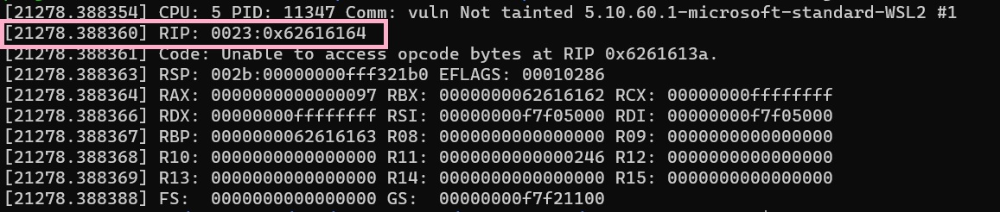

### Current progress: not done

Similar to other buffer overflow challenges. We are given the `vuln` executable and the `vuln.c` source code.

`file` and `checksec` command show this executable to be:
- little endian, 32bit, and i386
- NX enabled

Since this is NX enabled (marking some addresses as no-execute), a traditional buffer overflow attack may not be possible.

From researching, we found that a [return to libc attack](https://0x10f8.wordpress.com/2019/05/21/subverting-nx-bit-with-return-to-libc/) is used to bypass this security protection.

First, let's look at the c source code. There are two things that seemed to be of note:

First, the `vuln` function:
```
void vuln(){
  char buf[BUFSIZE];
  gets(buf);
  puts(buf);
}
```
As you can see, this function uses `gets` function. 
This has similar effect to using `strcpy` previously mentioned, 
i.e. it is not safe and is the attack vector in these kinds of buffer overflow exploit.


Next is this part from the `win` function (only shown here are the interested lines).
```
void win(unsigned int arg1, unsigned int arg2) {
    char buf[FLAGSIZE];
    FILE *f = fopen("flag.txt","r");
    ...

    char buf[FLAGSIZE];
    fgets(buf,FLAGSIZE,f);
    if (arg1 != 0xCAFEF00D)
        return;
    if (arg2 != 0xF00DF00D)
        return;
    printf(buf);
}
```
As shown above, it needs two specific arguments to be able to print the `buf` where our flag is stored in the end.
This means we either have to bypass these arguments or run the function using them somehow.


Then, we looked into running cyclic on the offset by using `dmesg | tail` as shown below (this is on WSL2, so some stuffs are different from a normal linux distro):


