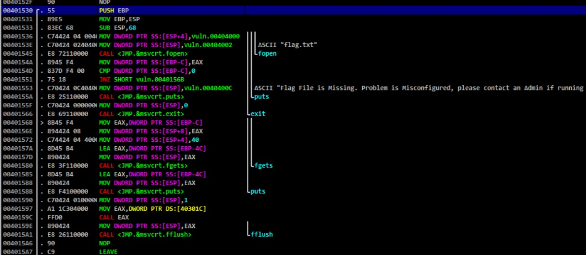

### Current progress: Done

A `vuln.exe` is given alongside the `vuln.c` source code. 

The file command shows that `vuln.exe` is an i386-32bit windows executable.
Since we are using `wsl` anyway, we can run this without the need of wine (allow the file from windows defender first, since it detected this as a virus when we know its just bad coding).


We downloaded and use `Immunity Debugger` on windows. In which we are then able to fuzz out the offset of:

`128 (buffer) + 8 + 4 (ESP)` and after that we can write to the `EIP`.
We also found within the debugger that `0x401530` is our `win` function address:



With our knowledge from solving `x-sixty-what`, it is possible that the
`PUSH EBP` may needed to be jump pass since we overwrite `EBP` with our buffer overflow attack. So, we are going to use the address `0x401531` instead.

Knowing [the weirdness of python3's hex bytes](https://stackoverflow.com/questions/54550845/strange-behaviour-of-python3-in-hex), we run the code below in our windows' powershell:
```powershell
python -c "import sys;sys.stdout.buffer.write(b'A'*128 + b'B'*12 + b'\x31\x15\x40\x00')" | .\vuln.exe
```
This gives us the test flag. However, it does not seem like we get a response we want when this is done to the `nc` server...

We ended writing a simple [exploit.py](exploit.py) that only receive lines before the program crashes.
Running the script gives us our flag: `picoCTF{Un_v3rr3_d3_v1n_bb39a2a4}`