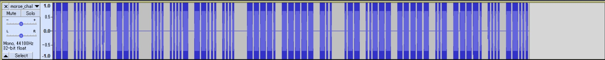

### Current progress: Done

A `morse_chal.wav` is given.

We opened this up in Audacity, which shows the following:

This can be transformed into: `.-- .... ....- --...   .... ....- --... ....   ----. ----- -..   .-- ..--- ----- ..- ----. .... --...`

Using this [morse translator](https://morsecode.world/international/translator.html) we get: `WH47 H47H 90D W20U9H7`

Wrapping under picoCTF flag format, make the pause underscore, lowercase the letters, and we get our flag: 
`picoCTF{wh47_h47h_90d_w20u9h7}`