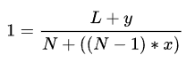

Using the method of decryption provided by [wikipedia](https://en.wikipedia.org/wiki/Rail_fence_cipher)

Given ciphertext: `Ta _7N6D54hlg:W3D_H3C31N__510ef sHR053F38N43D28 i33___N2`

K(length of first and last string)= `?`
L(length of ciphertext) = `56`
N(number of rails)= `4`
y(number of empty spaces)= `?`
x+1(number of diagonal lines)= `?`

Formula: 

Using the formula, we calculate y= `2` and x= `18`

With that we get:
```
T     a           _     7     N     6     D     5     4 
 h   l g   : W   3 D   _ H   3 C   3 1   N _   _ 5   1 0
  e f     s   H R   0 5   3 F   3 8   N 4   3 D   2 8   
         i     3     3     _     _     _     N     2 
```

Flag: `picoCTF{WH3R3_D035_7H3_F3NC3_8361N_4ND_3ND_55228140}`


