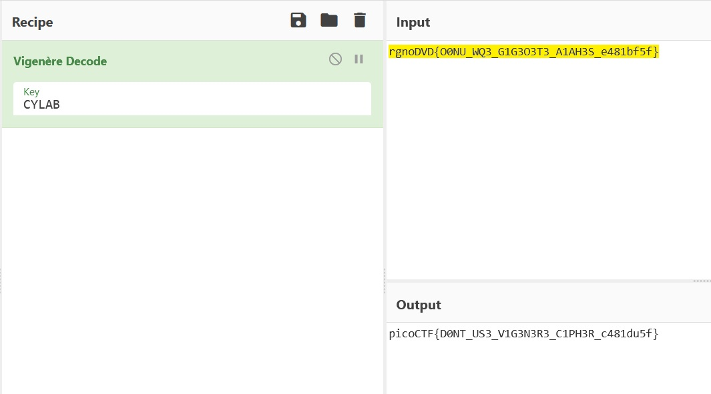

## Current progress: Done

These two files are given to us:
- `rgnoDVD{O0NU_WQ3_G1G3O3T3_A1AH3S_e481bf5f}` text file
- `CYLAB` is the key

This was run in [CyberChef](https://gchq.github.io/CyberChef/) with the above configuration:

The flag is `picoCTF{D0NT_US3_V1G3N3R3_C1PH3R_c481du5f}`