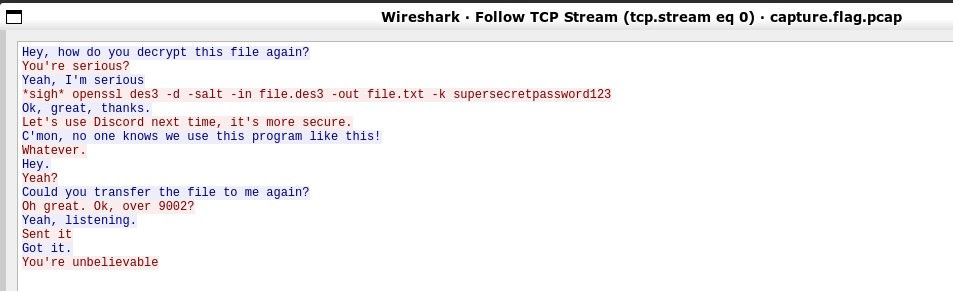
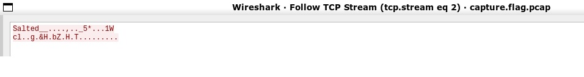

### Current progress: not done

A `capture.flag.pcap` packet capture file is given.

We opened this file up in wireshark and follow the TCP stream.
There are 3 streams - two of which seems to be important for us.

Stream 0 looks like the following:

And Stream 2:

Stream 0 tells us that the flag could potentially be encrypted in a `DES3` encryption.
We can potentially decrypt this with: `openssl des3 -d -salt -in file.des3 -out file.txt -k supersecretpassword123`

Stream 2 is actually this flag file mentioned above, seeing as it is being transferred via port `9002`.

We were trying to extracted the stream 2 value to python using the "c array" format in wireshark.
However, it seems to show a `bad decrypt` error.

So we went for a different approach by using `tcpflow -r capture.flag.pcap` to help us extract the file instead.
After this, we are able to go through the files extracted and find the des3 encrypted file. 
We renamed it to `file.des3` and run the openssl decrypt command.

After this, we got our flag: `picoCTF{nc_73115_411_77b05957}`