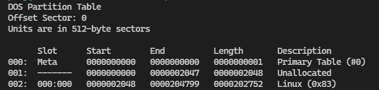

## Current progress: Done

a `disk.img.gz` was given.
The prompt asked us to find the Linux partition size using `mmls` command.

According to [the Sleuth kit documentation](http://www.sleuthkit.org/sleuthkit/man/mmls.html), `mmls` shows the partition table of the volume.

Running `mmls` shows us the following:

As you can see, the length of the Linux partition is shown to be `202752`.
We can now netcat into the server and input this length, which gives our flag:
`picoCTF{mm15_f7w!}`