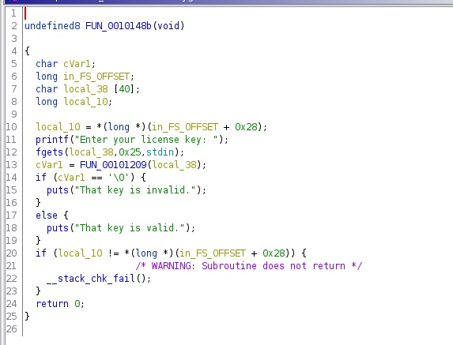
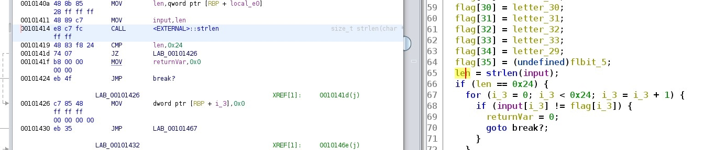
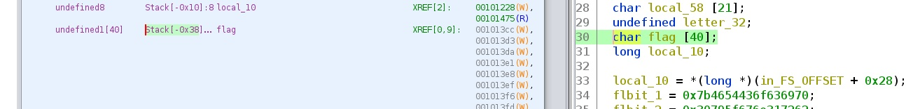

### Current progress: not done

A `keygenme` binary is given. This binary is an amd64 little endian executable.
The binary asks for a license key. In which we assume that we need to find the key within the binary.

So we fire up ghidra:
The `entry` function seems to run this `libc_start_main`: 
`__libc_start_main(FUN_0010148b,in_stack_00000000,&stack0x00000008,FUN_00101520,FUN_00101590,param_3,auStack8);`

This should be where we should look into.
Here's the code of the function `FUN_0010148b`:



From how its implemented, with the `printf` and the checks and whatnot, for our intents and purposes 
this could be our main function. So, we renamed it as such. 

Seems like it `fgets` 0x25 (37) characters of the input. 
This means we need 36 characters for our flag (last character being `\0` bytes to indicate the end of string)
Then, the value above is passed into `FUN_00101209` function.
This function seems to handle our input and returns `\0` if it's an "invalid key"

In the `FUN_00101209` we found these values:
```c
local_98 = 0x7b4654436f636970;
local_90 = 0x30795f676e317262;
local_88 = 0x6b5f6e77305f7275;
local_80 = 0x5f7933;
local_ba = 0x7d;
```

We realized this is the leetspeak text part of the flag, so we made [join_key](join_key.py) to solve this.
It solves out as `picoCTF{br1ng_y0ur_0wn_k3y_}` which is still an incomplete flag.

We are missing 8 characters (We have 28 characters, so subtract from 36).
It seems like the `FUN_00101209` passes the above values into `MD5` function.
This is probably just an MD5 algorithm, but after that it seems to jumble this all up.

### Solution
We were overthinking a bunch of things. However, we solved it in the end by watching up on LiveOverflow's video about [main() in stripped binary](https://youtu.be/N1US3c6CpSw).

This video taught us how we could use gdb to set breakpoint even when the binary is stripped.

We fire up `ghidra` alongside `gdb` to check the offset of the functions and variables we want.

Then, we set breakpoint with `break __libc_start_main` since it is likely that there will be a library load (so we hit `y` on the prompt after the breakpoint command).

After that, we run the binary with `r` command, and found the following:
```
Breakpoint 1, __libc_start_main (main=0x55555555548b, argc=1, argv=0x7fffffffdc38, init=0x555555555520,
    fini=0x555555555590, rtld_fini=0x7ffff7fe21b0 <_dl_fini>, stack_end=0x7fffffffdc28) at ../csu/libc-start.c:141
``` 

We see that the the `main` argument is at `0x55555555548b`. We cross referenced this with ghidra and found main there to be at `0x0010148b`. 
As you can see, the last 3 hex values are the same. This means it is probably the offset we needed to set breakpoint in our gdb.

So, we find the address where the flag array has been initialized.
This seems to be at the offset `414` per the image below:


After we found this, we set the breakpoint at `0x555555555414` (`0x555555555` + offset) and then continue the program with `c` command.

The program prompts us for input, which we can type in anything anyway since we set the breakpoint prior to the input check anyway.

After that, the breakpoint was reached. We went to see where the flag was stored in the memory. Somehow, the variable name has to be changed first otherwise we can't see the address, so we changed the variable from `acStack56` to `flag`.

After that, we can see our `flag` variable being stored at `Stack[-0x38]` (aka `rbp-0x38`):



So we run `x` (examine) command with argument `/s` (string) on `rbp-0x38`:
```
(gdb) x/s $rbp-0x38
0x7fffffffdab8: "aa0495cfpicoCTF{br1ng_y0ur_0wn_k3y_247d8a57}\377\177"
```

In there we can find our flag: `picoCTF{br1ng_y0ur_0wn_k3y_247d8a57}`