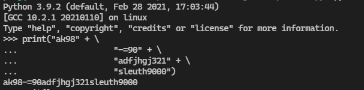

## Current progress: Done

This challenge gives a python code, with an xor function and a `level_1_pw_check` function:

```py
def level_1_pw_check():
    user_pw = input("Please enter correct password for flag: ")
    if( user_pw == "ak98" + \
                   "-=90" + \
                   "adfjhgj321" + \
                   "sleuth9000"):
        print("Welcome back... your flag, user:")
        decryption = str_xor(flag_enc.decode(), "utilitarian")
        print(decryption)
        return
    print("That password is incorrect") 
```

What we did is, simply running the expression to the right hand side of the if statement:



Copying this and running the python script with this password shows:
`picoCTF{p47ch1ng_l1f3_h4ck_4d5af99c}` - out flag