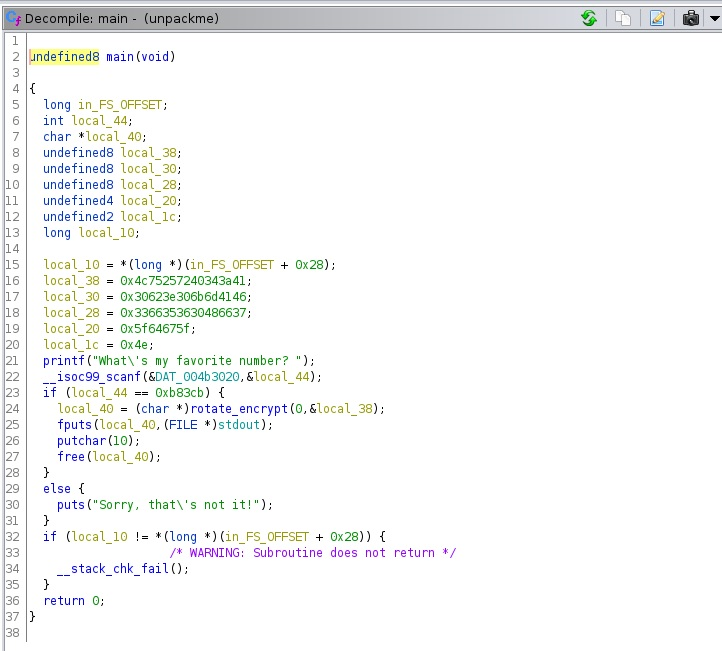

### Current progress: Done

The file `unpackme-upx` was given. It is an amd64 little endian binary file.

Running `unpackme-upx` shows a prompt asking `What's my favorite number?`.
We entered a random number and strings, but all of them outputs `Sorry, that's not it!`

We tried opening this in ghidra. 
However, it seems to be fulled of functions we could not comprehend,
and there is no signs of any libc functions that could be easily interpreted at all.

After reading the challenge name, and the filename again, we found out that
the file is packed with [upx packer](https://upx.github.io/).

We install `upx` via apt, and then run the following command to decompress the binary:
`upx -d unpackme-upx -o unpackme`

Then, we opened `unpackme` with ghidra, and now we found the main function:


Seems like our input is read with `scanf` and stored into `local_44` variable.
This variable is then compared with the hexadecimal `0xb83cb`

```c
if (local_44 == 0xb83cb) {
    local_40 = (char *)rotate_encrypt(0,&local_38);
    fputs(local_40,(FILE *)stdout);
    putchar(10);
    free(local_40);
}
```

Seems like this `0xb83cb` is the number we. Running this is python shows the value of `754635`
After inputting this value back into the binary, we got our flag: `picoCTF{up><_m3_f7w_ed7b0850}`