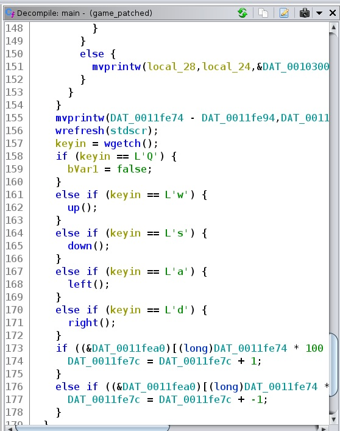
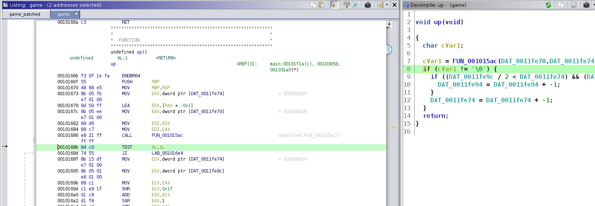
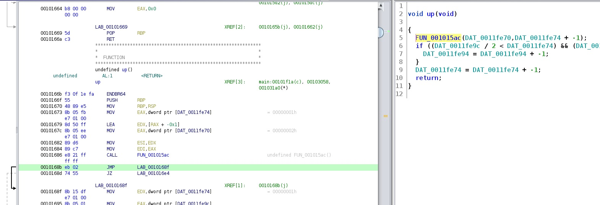

### Current progress: Done 

A `game` binary file is given. It is a 64-bit executable that has all the security protections enabled.

According to the challenge description. This is supposedly a dungeon crawler game.
From the hints, it seems like we should:
- Use radare2 instead of ghidra for debugging rather than static analysis. (gdb probably also works, but it's not as powerful).
- Find a way to teleport our characters.

However, after trying around in radare2 and gdb for a while, we ended up doing the opposite.

We opened up ghidra, and then rename the functions inside our main (`0x0010185b`):

With this, we found the function `up`, `down`, `left`, and `right`.

We went into the function, and remove the check for walls and gaps in the game by jumping over the instructions via `Ctrl+Shift+G` (patch instruction).

Here is the instruction before the patch:

Here is the instruction after the patch:

The aboves are for the function `up`. We also do this same thing for the other move functions.
After that, we hit `o` to export the file to an `ELF` so that we could run it.

Once we are able to go out of bounds, we fly around each level and screenshot them into
`flag_#.jpg` (where # is the level number).

We are then able to construct the flag from those ASCII art to be: `picoCTF{ur_4_w1z4rd_2A05D7A8}`